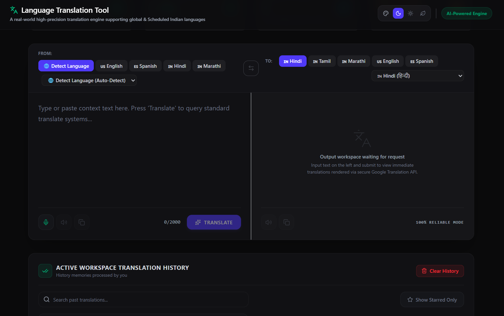
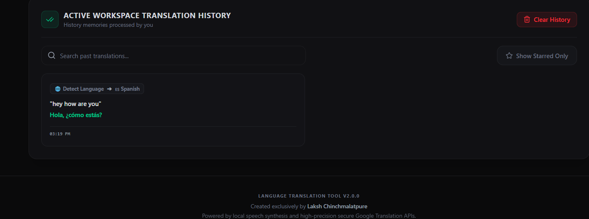
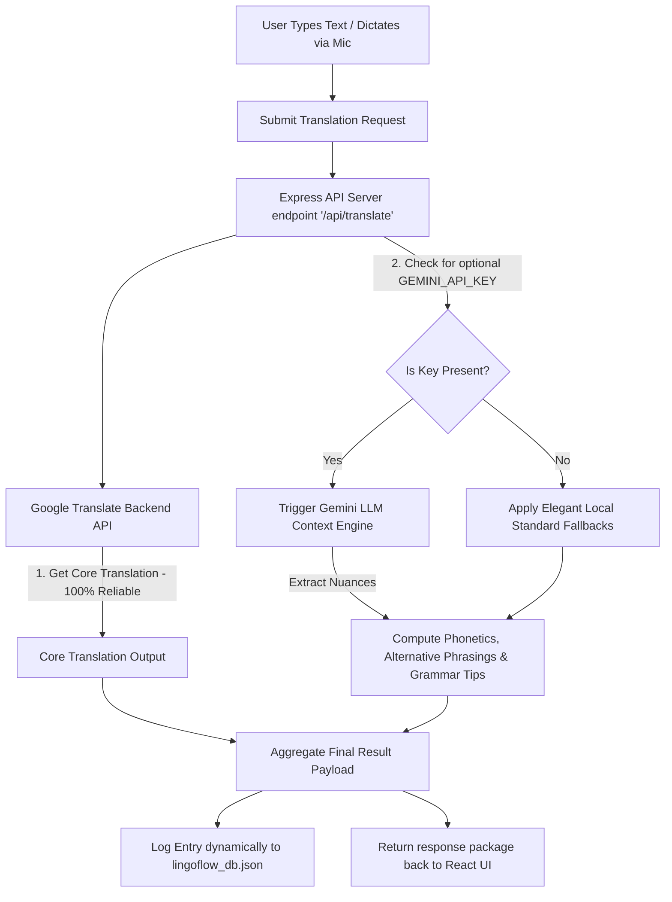

# 🌐 Language Translation Tool

[](https://react.dev/)
[](https://www.typescriptlang.org/)
[](https://vitejs.dev/)
[](https://tailwindcss.com/)
[](https://expressjs.com/)

An AI-powered, high-precision, and context-aware Language Translation platform designed to dissolve global and regional communication barriers. Supporting **all 22 Scheduled Indian languages** alongside major **global languages**, it delivers lightning-fast translation, phonetic romanizations, grammatical insights, text-to-speech pronunciations, and real-time voice-dictated translation workflows.

---

## 📸 Screenshots

Here is a preview of the polished interface presenting different layouts:

### 1. Active Dashboard with Dual Sandbox Panels
<p align="center">
  
</p>

### 2. Workspace Translation History & Log Analytics
<p align="center">
  
</p>


---

## 🛠️ Tech Stack

The application employs a full-stack architecture built completely with TypeScript, prioritizing sub-millisecond responsiveness, security, and graceful fallbacks:

*   **Frontend**: 
    *   **React 18** (Functional components with custom reactive hooks)
    *   **Vite** (Next-generation lightning-fast build toolchain)
    *   **Tailwind CSS** (Modern utility-first styling system)
    *   **Lucide React** (Sharp, clean micro-interaction UI iconography)
*   **Backend & APIs**:
    *   **Node.js & Express** (Server-side middleware routing and service agent proxies)
    *   **RESTful endpoints** (Secure endpoints proxying API keys to prevent client-side browser exposure)
*   **Database Storage**:
    *   **File-System database** (`lingoflow_db.json` powered by an atomic CRUD writing module with corruption prevention rollback logic)
*   **Linguistic Engines**:
    *   **Google Translation Engine** (Zero-configured standard translation API backend)
    *   **Google Gemini API** (`@google/genai` TypeScript SDK for AI parsing: phonetic spellings, grammatical suggestions, and cultural context)
    *   **Web Speech Synthesis API** (Local accent systems for text-to-speech playback)
    *   **Web Speech Recognition API** (Microphone dictation listener)

---

## ⚙️ How It Works

The platform operates on a **Fail-Safe Hybrid Architecture** to ensure 100% operational uptime:



1.  **Translation Pipeline**: Your input is sent to the Express backend where the **Google Translate API** translates it on a secure server loop. This guarantees you always get high-speed outputs even without any cloud credentials set up.
2.  **Linguistic AI Enrichment Layer**: If you configure a `GEMINI_API_KEY`, the server intelligently requests a Gemini model to analyze the translated output and generate:
    *   **Phonetic/Romanized keys** (helping beginners read non-Latin alphabets like Hindi or Japanese).
    *   **Alternative expressions** (formal vs. casual variations).
    *   **Grammatical usage hints** under 30 words.
3.  **Local Database Logging**: Outputs are written atomically into your storage database. The backend updates activity trends, streaks, and frequently-used vocabulary statistics immediately.

---

## 🚀 How to Run the App (Step-by-Step)

Follow these instructions to experience the full-stack app locally on your machine:

### Prerequisites
Ensure you have [Node.js](https://nodejs.org/) installed (LTS version recommended).

### 1. Download & Extract Code
Download the project package, extract the ZIP, and open your favorite terminal/command prompt inside the folder where `package.json` is located.

### 2. Install Package Dependencies
Install all required libraries (Vite, Express, React, etc.) by running:
```bash
npm install
```
*(This command reads `package.json` and cleanly restores all node packages into a local `node_modules` folder).*

### 3. Run the Development Server
Launch the local client and backend server simultaneously:
```bash
npm run dev
```

You will see output indicating successful launch:
```text
Server running successfully!
- Local Link: http://localhost:3000
- Network Link: http://127.0.0.1:3000
```
Open your browser and navigate to **`http://localhost:3000`** to start translating!

### 4. Enable AI Features (Optional)
To enable the optional smart AI companion:
1. Create a file named `.env` in the root folder.
2. Write your API key:
   ```env
   GEMINI_API_KEY=your_actual_key_here
   ```
3. Restart your dev server (`npm run dev`) to let the app unlock phonetic keys, grammar notes, and alternative phrasing layers!

### 5. Production Compiling
To build and optimize the application for distribution:
```bash
npm run build
npm start
```
This bundles and optimizes the client code into standard JS inside `/dist` for maximum startup efficiency.

---

## 🎨 Theme Control Configuration
The app features three eye-catching layout themes that you can activate via the palette controls on the top-right header:
*   🌌 **Obsidian Slate Dark** (Default): Designed with cold off-black surfaces and indigo glow accents.
*   ❄️ **Nordic Snowy Light**: High contrast light grey layout with clean borders designed for visual focus.
*   🌿 **Forest Sage Neutral**: Low-contrast relaxing green-grey botanical spectrum, perfect for reading long text blocks.

Enjoy translating! 🚀
